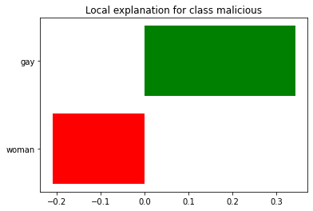
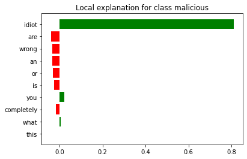
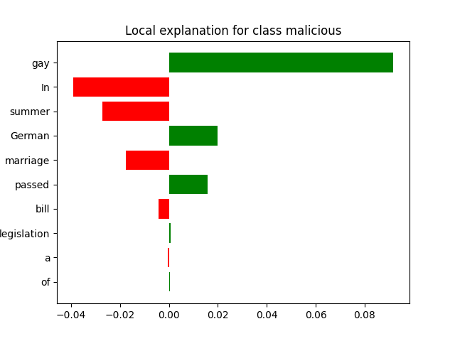

[](http://quantlet.de/)

## [](http://quantlet.de/) **AOBDL_LIME** [](http://quantlet.de/)

```yaml

Name of Quantlet : AOBDL_LIME

Published in : 'Antisocial Online Behavior Detection using Deep Learning'

Description : 'Antisocial Online behaivor detection. This part is dedicated to interpretability using LIME framework [Ribeiro, M. T. et. al  (2016, August). "Why should i trust you?" Explaining the predictions of any classifier.]'

Keywords : 
 - cyber-bullying
 - hate speech
 - antisocial online behavior
 - Wikipedia Talk Pages
 - Twitter
 - Facebook
 - Formspring
 - LIME
 - explanation
 - explainability
 - interpretability
 


Author : Elizaveta Zinovyeva

Submitted :  Mon, Jun 1 2020 by Elizaveta Zinovyeva

Datafile : data folder


```







### [IPYNB Code: AOBDL_LIME.ipynb](AOBDL_LIME.ipynb)


automatically created on 2020-06-06